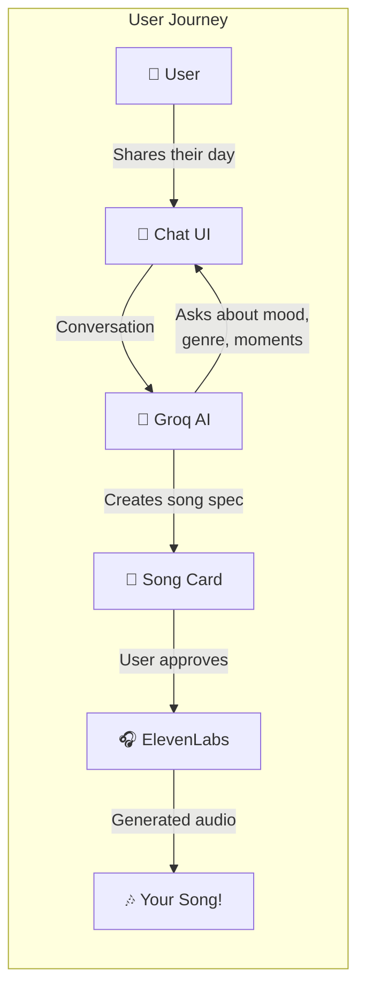
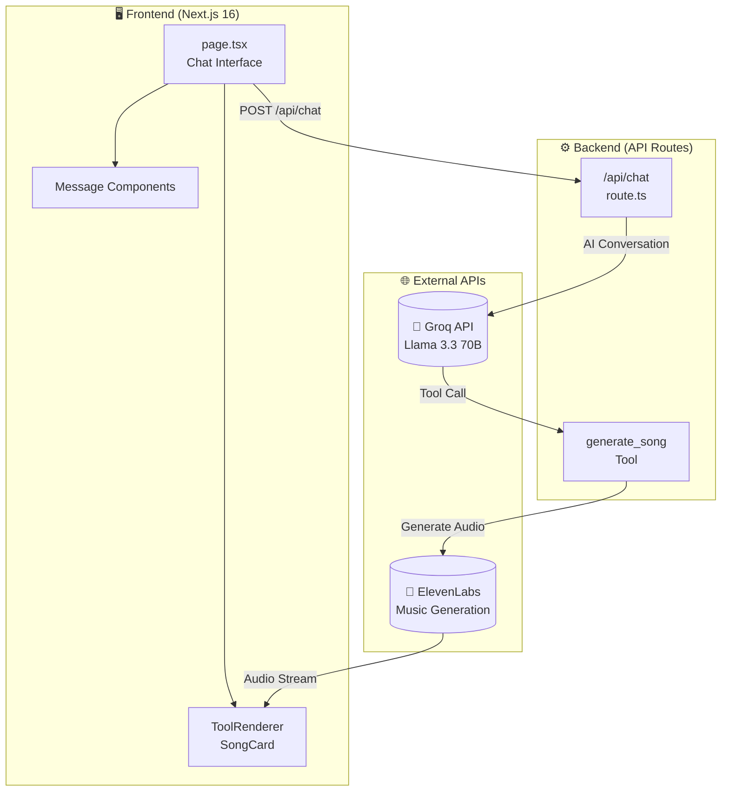
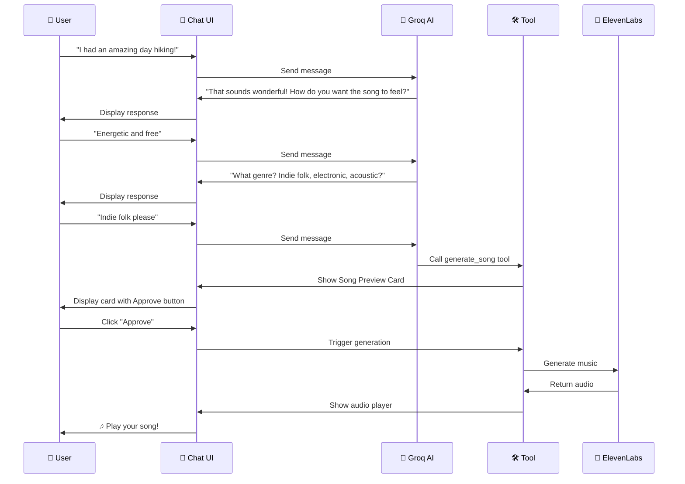
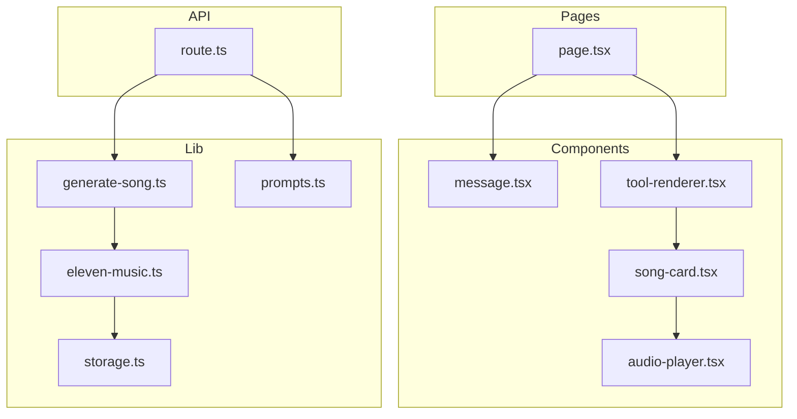
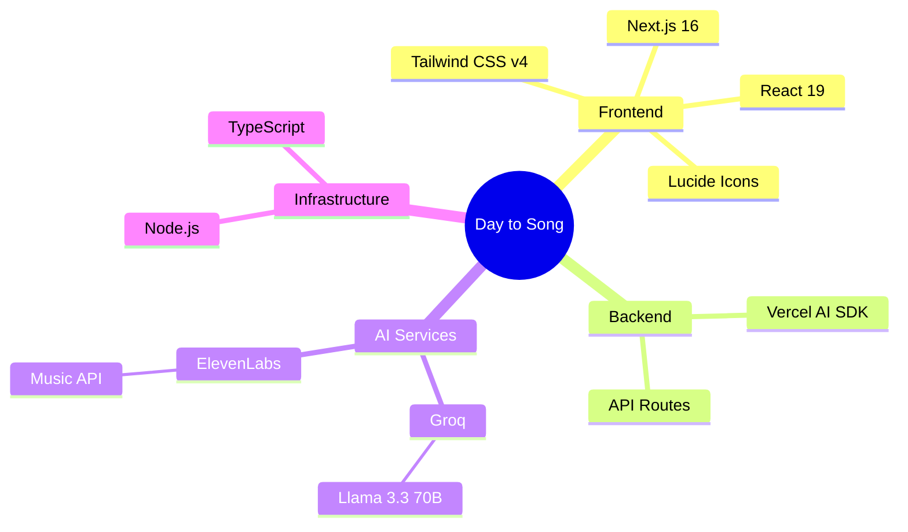

# 🎵 Day to Song

**Turn your daily experiences into personalized music using AI.**

An AI-powered journaling companion that transforms how you felt about your day into a unique audio experience.

---

## 🎯 How It Works



---

## 🏗️ System Architecture



---

## 🔄 Conversation Flow



---

## 📦 Component Structure



---

## 🚀 Quick Start

### 1. Clone & Install

```bash
git clone https://github.com/prasiddhnaik/Music-agent.git
cd Music-agent
npm install
```

### 2. Configure Environment

Create `.env.local` with your API keys:

```env
GROQ_API_KEY=your_groq_api_key
ELEVENLABS_API_KEY=your_elevenlabs_api_key
```

**Get your keys:**
- Groq: https://console.groq.com/keys (FREE)
- ElevenLabs: https://elevenlabs.io/app/settings/api-keys

### 3. Run

```bash
npm run dev
```

Open http://localhost:3000

---

## 🛠️ Tech Stack



---

## 📁 Project Structure

```
src/
├── app/
│   ├── api/chat/
│   │   └── route.ts        # AI chat endpoint
│   ├── page.tsx            # Main chat UI
│   └── globals.css         # Styles
├── components/
│   ├── chat/
│   │   ├── message.tsx     # Chat message bubble
│   │   └── tool-renderer.tsx
│   ├── song-card.tsx       # Song preview/player
│   └── audio-player.tsx    # Audio controls
└── lib/
    ├── tools/
    │   ├── generate-song.ts  # AI tool definition
    │   └── eleven-music.ts   # ElevenLabs integration
    ├── types.ts
    └── utils/
        ├── prompts.ts      # System prompt
        └── storage.ts      # Audio file storage
```

---

## 🏆 Hackathon

Built for MLH Hackathon - **Best Use of ElevenLabs** category.

---

## 📄 License

MIT
